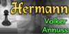
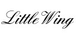

| Engine | Version | Logo | Author | Protocol | Code source | FRC support | Strength | Link |
| --- | --- | --- | --- | --- | --- | --- | --- | --- |
| Alouette | 0.0.9 |  | Roland Chastain | UCI | Pascal | Yes | A | [Website](https://sites.google.com/view/eschecs/alouette) [Website](https://github.com/rchastain/alouette) |
| Cheng4 | 0.39 |  | Martin Sedlak | UCI | C++ | Yes | E | [Website](http://www.vlasak.biz/cheng/) |
| CT800 | 1.34 |  | Rasmus Althoff | UCI | C | No | D | [Website](https://www.ct800.net/) |
| Enxadrista | 1.01 |  | Alcides Schulz | XBoard | C# | No | A | [Website](https://github.com/alcides-schulz/Xadrez) |
| Floyd | 0.9 |  | Marcel van Kervinck | UCI | C | No | E | [Website](https://marcelk.net/floyd/) [Website](https://github.com/kervinck/floyd) |
| Fridolin | 2.00 |  | Christian Sommerfeld | UCI | C++ | Yes | E | [Website](https://sites.google.com/site/fridolinchess/) |
| Galjoen | 0.40 |  | Werner Taelemans | UCI | C++ | Yes | E | [Website](http://www.goudengaljoen.be/) |
| Geko | 0.4.3 |  | Giuseppe Cannella | XBoard |  | No | C | [Website](https://github.com/gekomad) |
| Hermann | 2.8 |  | Volker Annuss | UCI |  | Yes | E | [Website](http://www.nnuss.de/Hermann/) |
| La Dame Blanche | 2.0 |  | Marc-Philippe Huget | XBoard |  | No | D | [Website](http://www.quarkchess.de/ladameblanche/) |
| LittleWing | 0.6 |  | Vincent Ollivier | UCI | Rust | No | D | [Website](https://vinc.cc/projects/littlewing/) [Website](https://github.com/vinc/littlewing) |
| Monolith | 1.0 |  | Jonas Mayr | UCI | C++ | Yes | E | [Website](https://github.com/cimarronOST/Monolith) |
| Moustique | 0.3 |  | Jürgen Schlottke, Roland Chastain | UCI | Pascal | No | B | [Website](https://sites.google.com/view/eschecs/moustique) [Website](https://github.com/rchastain/moustique) |
| N.E.G. | 1.2 |  | Harm Geert Muller | XBoard | C | No | A | [Website](https://home.hccnet.nl/h.g.muller/chess.html) |
| Pharaon | 3.5.1 |  | Frank Zibi | UCI |  | Yes | E | [Website](http://www.fzibi.com/pharaon.htm) |
| PolarChess |  |  | Odd Gunnar Malin | UCI | C++ | Yes |  | [Website](https://github.com/OGMalin/Polarchess) |
| Rodent |  |  | Pawel Koziol | UCI | C++ | No |  | [Website](http://www.pkoziol.cal24.pl/rodent/rodent.htm) |
| Sapeli | 1.53 |  | Toni Helminen | UCI | C | Yes | D | [Website](https://github.com/SamuraiDangyo/Sapeli) |
| Senpai | 2.0 |  | Fabien Letouzey | UCI | C++ | Yes | E | [Website](http://www.amateurschach.de/main/_senpai.htm) |
| SlowChess |  |  | Jonathan Kreuzer | UCI | C++ | Yes | E | [Website](https://www.3dkingdoms.com/chess/slow.htm) |
| Xadreco | 5.71 |  | Ruben Carlo Benante | XBoard | C | No | B | [Website](https://github.com/drbeco/xadreco) |

The indication of engines strength is approximate. For more precise information, please see the [CCRL website](https://www.computerchess.org.uk/ccrl/).
