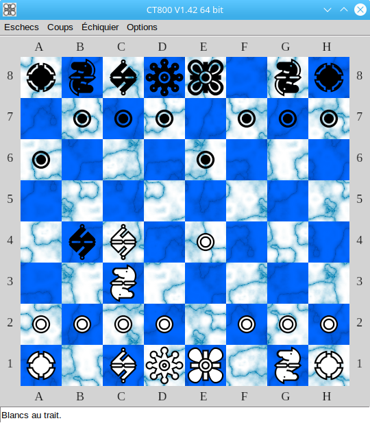

# Eschecs

## Overview

*Eschecs* is a simple graphical interface to play chess against [UCI](http://www.shredderchess.com/chess-info/features/uci-universal-chess-interface.html) engines.

## Usage

*Eschecs* is shipped with an engine (Cheng). If you wish to use another one, start *Eschecs* with the engine path as parameter.

```
./eschecs /home/robert/uciengines/CT800_V1.42
```

You can find [here](https://github.com/rchastain/eschecs/blob/master/ENGINES.md) a collection of UCI engines that you could use with *Eschecs*.

## Screenshot



You can see more screenshots on [this page](https://github.com/rchastain/eschecs/blob/master/images/screenshots/README.md).

## Command line options

The behaviour and the appearance of *Eschecs* can be set using the following command line parameters.

| Parameter name | Parameter value |
| --- | --- |
| `-p <v>`, `--position=<v>` | The position to be loaded, in FEN format. |
| `-a <v>`, `--autoplay=<v>` | The computer will be the second player. |
| `-t <v>`, `--time=<v>` | Time allowed for the computer move, in milliseconds. |
| `-u <v>`, `--upsidedown=<v>` | Draw the chessboard upside down. |
| `-c <v>`, `--chessboard=<v>` | Appearance of the chessboard. |
| `-m <v>`, `--marblecolors=<v>` | Marble colors. |
| `-f <v>`, `--font=<v>` | Piece set. See below possible values. |
| `-l <v>`, `--language=<v>` | Language. See below possible values. |
| `-s <v>`, `--size=<v>` | Size of the square. See below possible values. |
| `-w <v>`, `--white=<v>` | Color of white squares. |
| `-b <v>`, `--black=<v>` | Color of black squares, same format. |
| `-g <v>`, `--green=<v>` | Color for legal target squares. |
| `-r <v>`, `--red=<v>` | Color for the square of a king being in check. |

See *start.sh* for more precise information about parameters possible values.

### Available fonts and sizes

```
Alpha    30, 40, 50, 60, 70, 80, 90, 100
Condal   30, 40, 50, 60, 70, 80, 90, 100
Line     30, 40, 50, 60, 70, 80, 90, 100
Lucena   30, 40, 50, 60, 70, 80, 90, 100
Magnetic 30, 40, 50, 60, 70, 80, 90, 100
Mark     30, 40, 50, 60, 70, 80, 90, 100
Montreal 30, 40, 50, 60, 70, 80, 90, 100
Usual    30, 40, 50, 60, 70, 80, 90, 100
Wood     30, 40, 50, 60, 70, 80
```

### Available languages

* Czech
* Dutch
* English
* French
* German
* Italian
* Spanish

Thanks to the translators:

* Martin Sedlak (Czech)
* Jean-Luc Gofflot (Dutch)
* Users of the German [Lazarus forum](https://www.lazarusforum.de/index.php) (German)
* Marcello Basso (Italian)
* Ñuño Martínez (Spanish)

## Keyboard Controls

    ↑   Go to the last position
    ↓   Go back to the first position
    ←   Go back to the previous position
    →   Go to the next position
    ESC Close the application

## Technical informations

*Eschecs* is a Pascal program. If you wish to compile it yourself, you need the Free Pascal compiler.

If Free Pascal is installed, you can download and build *Eschecs* as follows:

```
git clone --recurse-submodules https://github.com/rchastain/eschecs.git
cd eschecs/source
make
```

Please notice that the *Makefile* included in this repository has been made for Linux. It you try to compile on another OS, you could have to retouch it.

You can also create a Lazarus or an MSEide project, or even write a simple script. In that case you can look into source/extrafpc.cfg to see which directories you need to add to your project options. 

## Authors

*Eschecs* is a program written by Roland Chastain, with contributions by Johann Elsass and Fred van Stappen.

## Credits

### Graphics

The application icon is the white king of the [Chess Montreal font](http://alcor.concordia.ca/~gpkatch/montreal_font.html).

The wood chessboard and its pieces are the work of [Daniela Di Lena](https://dilena.de/chess-artwork-pieces-and-board-art-assets).

The other pieces set has been made from TrueType chess fonts:

* *Chess Alpha* by Eric Bentzen
* *Chess Condal, Chess Line, Chess Mark* by Armando Marroquin
* *Chess Montreal* by Gary Katch

### Sounds

The sound effects come from [Lichess][1], the well-known chess server by Thibault Duplessis, and from [The Essential Retro Video Game Sound Effects Collection][2] by Juhani Junkala.

[1]: https://github.com/ornicar/lila/tree/master/public/sound
[2]: https://opengameart.org/content/512-sound-effects-8-bit-style

### Libraries

*Eschecs* uses the following libraries.

* [fpGUI](https://github.com/graemeg/fpGUI)
* [BGRABitmap](https://github.com/bgrabitmap/bgrabitmap)
* [LazUtils](https://sourceforge.net/projects/lazarus/)
* [uos](https://github.com/fredvs/uos)
