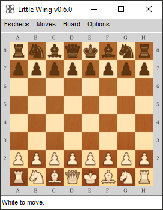

# Eschecs

## Overview

*Eschecs* is a graphical interface to play chess against [UCI](http://www.shredderchess.com/chess-info/features/uci-universal-chess-interface.html) engines.

## Usage

*Eschecs* is shipped with an engine. If you wish to use another engine, start *Eschecs* with the engine path as parameter.

### Command line options

| Parameter | Meaning |
| --- | --- |
| -p \<value\>, --value=\<value\> | The position to be loaded, in FEN format. |
| -a \<value\>, --autoplay=\<value\> | The computer will be the second player. Possible values: false, true. |
| -u \<value\>, --upsidedown=\<value\> | Draw the chessboard upside down. Possible values: false, true. |
| -c \<value\>, --chessboard=\<value\> | Appearance of the chessboard. Possible values: simple, marble, marble2, wood. |
| -m \<value\>, --movetime=\<value\> | Time allowed for the computer move, in milliseconds. |
| -f \<value\>, --font=\<value\> | Piece set. See below possible values. |
| -l \<value\>, --language=\<value\> | Language. See below possible values. |
| -s \<value\>, --size=\<value\> | Size of the square. See below possible values for each font. |
| -f \<value\>, --fischerandom=\<value\> | Play Fischer Random Chess. Possible values: false, true. |
| -w \<value\>, --white=\<value\> | Color of white squares, in RRGGBBAA format. |
| -b \<value\>, --black=\<value\> | Color of black squares, in RRGGBBAA format. |
| -g \<value\>, --green=\<value\> | Color of legal target squares, in RRGGBBAA format. |
| -r \<value\>, --red=\<value\> | Color of white squares, in RRGGBBAA format. |

#### Available fonts and sizes

* Alpha    30, 40, 50, 60, 70, 80, 90, 100
* Condal   30, 40, 50, 60, 70, 80, 90, 100
* Line     30, 40, 50, 60, 70, 80, 90, 100
* Lucena   30, 40, 50, 60, 70, 80, 90, 100
* Magnetic 30, 40, 50, 60, 70, 80, 90, 100
* Mark     30, 40, 50, 60, 70, 80, 90, 100
* Montreal 30, 40, 50, 60, 70, 80, 90, 100
* Usual    30, 40, 50, 60, 70, 80, 90, 100
* Wood     30, 40, 50, 60, 70, 80

#### Available languages

* Czech
* Dutch
* English
* French
* German
* Italian
* Spanish

## Technical informations

*Eschecs* is a Pascal program. If you wish to compile it yourself, you will need fpGUI, BGRABitmap and uos libraries.

## Screenshot

