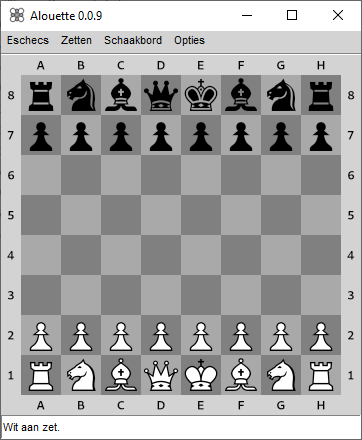
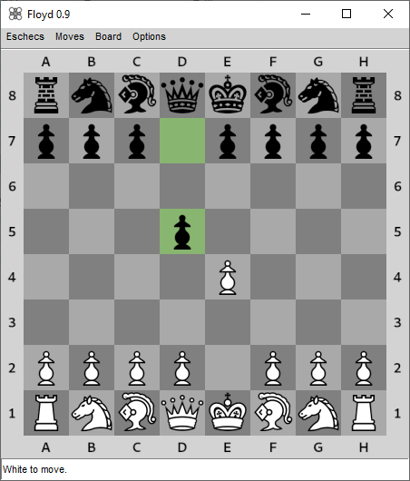
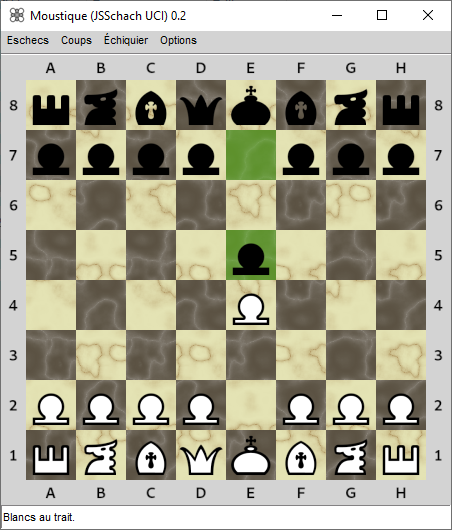
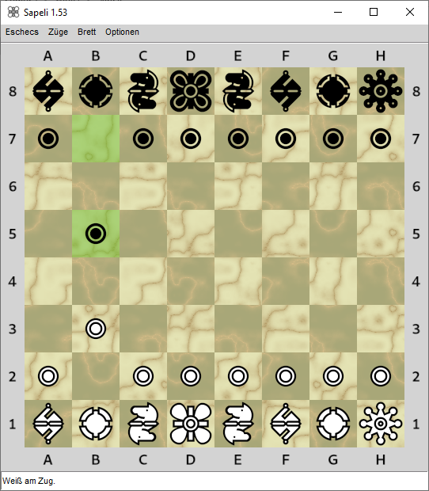
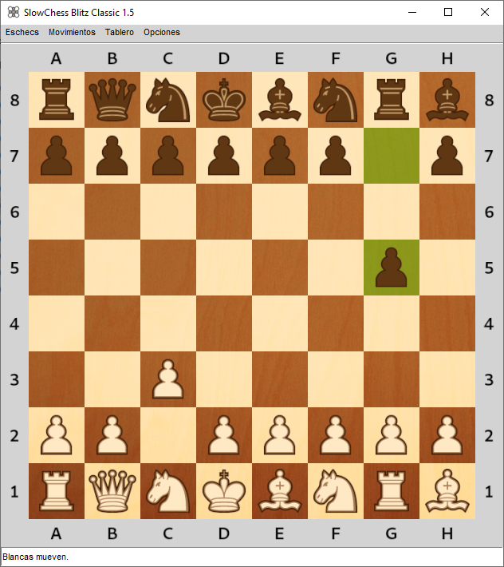
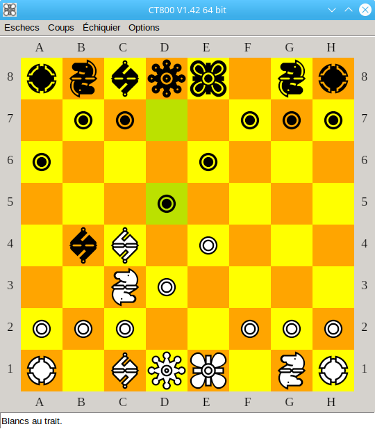

# Screenshots

```
--chessboard=simple --font=alpha
```



```
--chessboard=simple --font=condal
```



```
--chessboard=marbleoriginal --font=mark
```



```
--chessboard=marblenew --font=montreal
```



```
--chessboard=wood
```



```
--chessboard=wood --size=32
```


```
--chessboard=simple --white=FFFF00FF --black=FFA500FF
```



```
--chessboard=marblecustom --marblecolors=FFFFFFFF,0080B3FF,0066FFFF,0047B3FF
```


